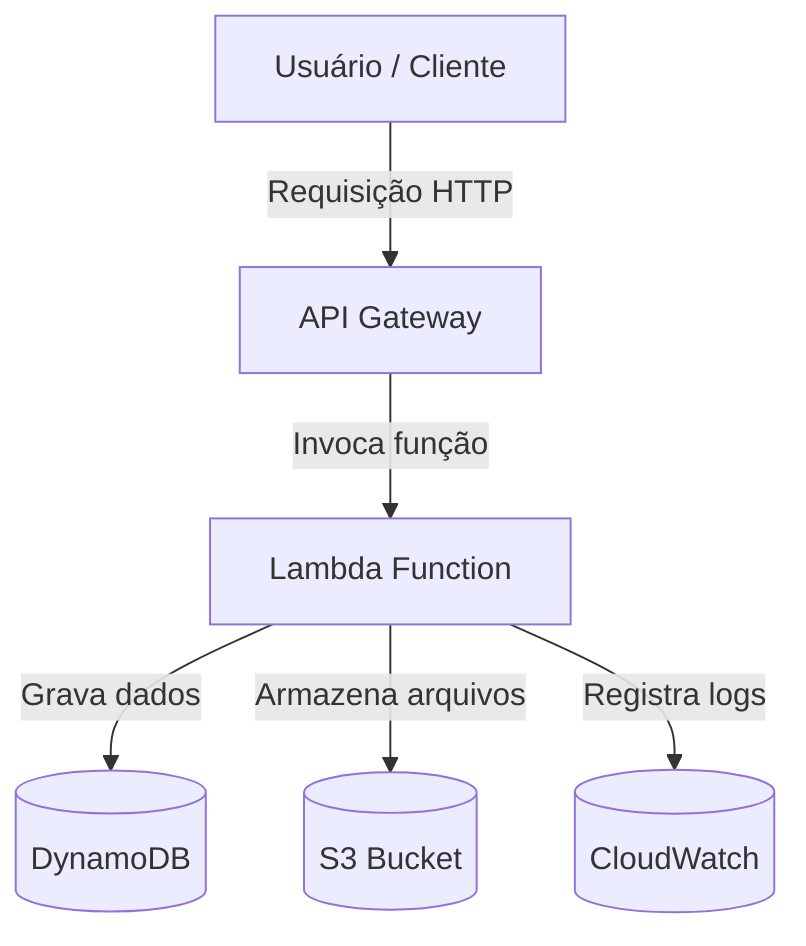

# V Desafio de Projeto - Executando Tarefas Automatizadas com Lambda Function e S3

Este projeto tem como objetivo **consolidar meus conhecimentos em tarefas automatizadas utilizando AWS Lambda e Amazon S3**, integrando também **DynamoDB, API Gateway e IAM** para construir uma arquitetura serverless completa e segura.

O entregável é um repositório contendo **anotações, exemplos práticos e insights adquiridos durante o laboratório**, servindo como **material de apoio** para estudos e futuras implementações.

---

## 🧩 Arquitetura da Solução


### Fluxo Resumido:

1. O usuário faz uma requisição HTTP via API Gateway.
2. O API Gateway aciona uma função Lambda.
3. A Lambda Function processa os dados:
4. Armazena metadados no DynamoDB;
5. Salva arquivos ou logs no S3;
6. Retorna uma resposta ao cliente via API Gateway.
7. O CloudWatch registra logs de execução para monitoramento e troubleshooting.

---

## ⚙️ Componentes Utilizados
### 🧠 AWS Lambda
- Serviço de computação serverless que executa código sob demanda.
- Neste projeto, a função Lambda é responsável por:
    - Processar os dados recebidos via API Gateway.
    - Gravar informações no DynamoDB.
    - Fazer upload ou download de arquivos no S3.

### Exemplo de Função Lambda (Python):

```python
import json
import boto3
import os

dynamodb = boto3.resource('dynamodb')
s3 = boto3.client('s3')

TABLE_NAME = os.environ['TABLE_NAME']
BUCKET_NAME = os.environ['BUCKET_NAME']

def lambda_handler(event, context):
    data = json.loads(event['body'])
    item_id = data.get('id')
    content = data.get('content')

    # Salva metadado no DynamoDB
    table = dynamodb.Table(TABLE_NAME)
    table.put_item(Item={'id': item_id, 'content': content})

    # Armazena conteúdo no S3
    s3.put_object(Bucket=BUCKET_NAME, Key=f"{item_id}.txt", Body=content)

    return {
        'statusCode': 200,
        'body': json.dumps({'message': 'Processamento concluído!', 'id': item_id})
    }
```
---
### 🪣 Amazon S3

- Serviço de armazenamento de objetos.
- Utilizado para armazenar arquivos gerados ou processados pela Lambda.
- Pode armazenar logs, backups ou uploads enviados pelos usuários.

#### Exemplo de uso:
- A Lambda salva um arquivo dados/<id>.json dentro do bucket meu-bucket-lambda-s3.

---

### 🧾 Amazon DynamoDB

- Banco de dados NoSQL totalmente gerenciado.
- Usado para armazenar informações sobre as tarefas processadas (metadados, status, timestamps).

Exemplo de estrutura de tabela:
| id  | content              | timestamp            |
| --- | -------------------- | -------------------- |
| 001 | "Teste de automação" | 2025-10-29T15:00:00Z |

---
### 🌐 Amazon API Gateway

- Responsável por expor endpoints HTTP/REST que acionam a Lambda.
- Permite autenticação, controle de acesso, limites de requisição e integração direta com funções Lambda.

#### Exemplo de endpoint:
```bash
POST https://xxxxxx.execute-api.us-east-1.amazonaws.com/dev/processar
```
--- 

### 🔐 AWS IAM

- Serviço que gerencia permissões e políticas de acesso.
- Neste projeto, são criados roles e políticas específicas para:
    - Permitir que a Lambda acesse o S3 e DynamoDB;
    - Controlar quem pode invocar a API Gateway.

#### Exemplo de Política IAM da Lambda:
```json
{
  "Version": "2012-10-17",
  "Statement": [
    {
      "Effect": "Allow",
      "Action": [
        "s3:PutObject",
        "s3:GetObject"
      ],
      "Resource": "arn:aws:s3:::meu-bucket-lambda-s3/*"
    },
    {
      "Effect": "Allow",
      "Action": "dynamodb:PutItem",
      "Resource": "arn:aws:dynamodb:us-east-1:123456789012:table/MinhaTabela"
    }
  ]
}
```
--- 

## 📘 Conceitos-Chave
| Serviço         | Conceito                                      | Benefício                                            |
| --------------- | --------------------------------------------- | ---------------------------------------------------- |
| **Lambda**      | Funções executadas sob demanda, sem servidor. | Custo por uso e alta escalabilidade.                 |
| **S3**          | Armazenamento de objetos.                     | Seguro, durável e integrado com vários serviços AWS. |
| **DynamoDB**    | Banco de dados NoSQL.                         | Performance previsível e alta disponibilidade.       |
| **API Gateway** | Porta de entrada para APIs.                   | Garante segurança e abstrai lógica de backend.       |
| **IAM**         | Controle de identidade e acesso.              | Define quem pode fazer o quê em cada serviço.        |

---
## 💡 Insights e Aprendizados
- A integração entre Lambda e outros serviços AWS permite construir aplicações completas sem gerenciar servidores.
- O controle de permissões no IAM é essencial para manter a segurança e o princípio do menor privilégio.
- O uso de logs no CloudWatch facilita a depuração e o monitoramento de eventos.
---

## 🧾 Licença

Este repositório é de uso pessoal e educacional.
Sinta-se à vontade para clonar, adaptar e evoluir este projeto!
